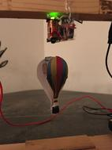
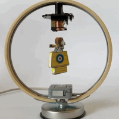
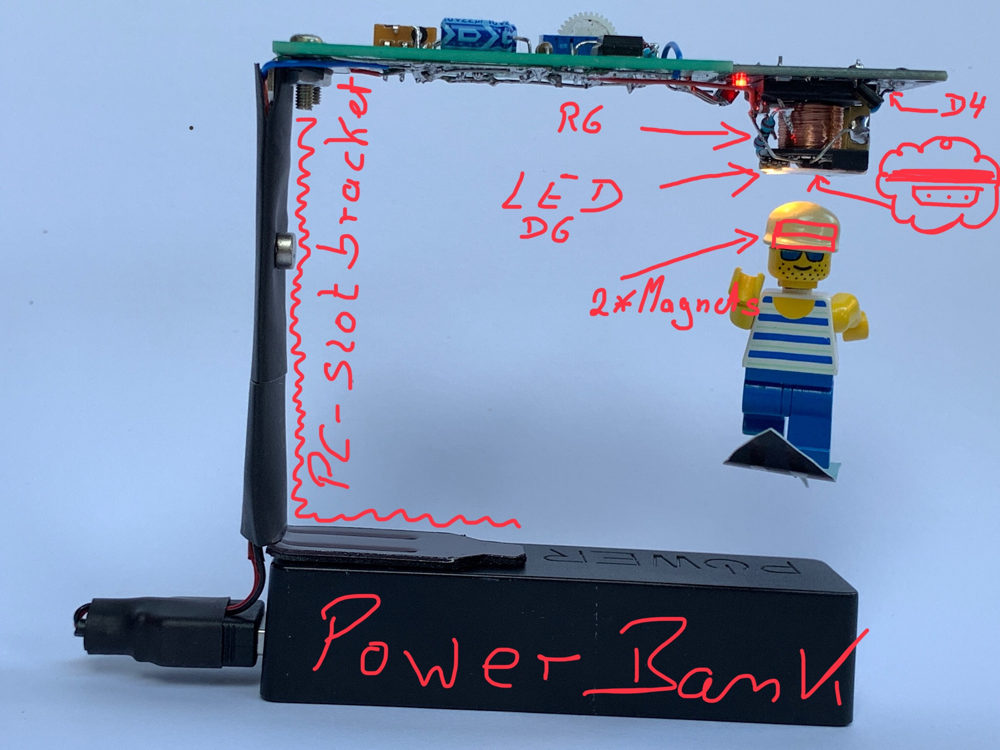
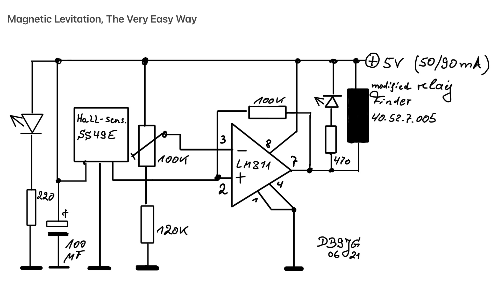

# magnetischesSchweben
Ein Projekt für eine Physik AG 

## Beschreibung
Eine Figur schwebt mit Magnetkraft frei in der Luft.

<!--  -->

Themen/Ablauf
- Beschreibung des Projekts und des Ablaufs
- Erläuterung und Diskussion des technischen Konzepts
- Erklärung der elektrischen Schaltung (erstaunlich einfach, ohne Computer)
- Erklärung der elektrischen Bauteile, Datenblätter 
        ◦ elektr. Bauteile sind festgelegt und vorhanden.
- Stromversorgung 5-6V – Empfehlung: USB, alternativ gehen auch Batterien oder Akkus 
        ◦ Wahl der Stromversorgung beeinflusst Schaltplan, Platinenlayout und Konstruktion  
- Erstellen des Schaltplans mit dem freien Softwareprgramm KiCAD 
        ◦ Schaltplan wird zur Verfügung gestellt
- Erstellen des Platinenlayout mit KiCAD 
        ◦ Platinen werden extern in Auftrag gegeben, Lieferzeit zwei bis drei Wochen 
        ◦ Wahl der Aufteilung der Elektronik, Elektromagnet separat oder alles auf einer Platine, beeinflusst das Layout und den Schaltplan.
- Konstruktion/Design eines Gerüsts/Halterung und der Schwebefigur 
        ◦ keine festen Vorgaben. Material muss rechtzeitig beschafft werden. 
        ◦ Neodym-Magnete sind rund Ø10mm x 2mm
- Bau des Gerüsts und der Schwebefigur 
- Einführung Weichlöten, Lötübungen 
- Bestückung und Löten der Leiterplatte 
- Zusammenbau und Inbetriebnahme 

## Elektrische Schaltung

## Datenblätter

### Hallsensor
[Hallsensor](SS49E.pdf)

### Komparator
[LM311](lm311.pdf)

### Elektromagnet (Relais)
[Elektromagnet](Relais-g2r.pdf)

## Projektidee
Die Projektidee stammt von Peter Neufeld
[wordpress blog](https://peterneufeld.wordpress.com/2021/07/01/magnetic-levitation-the-very-easy-way/)

## License
open source project

## Projekt Status
gestartet am 27.4.2022

